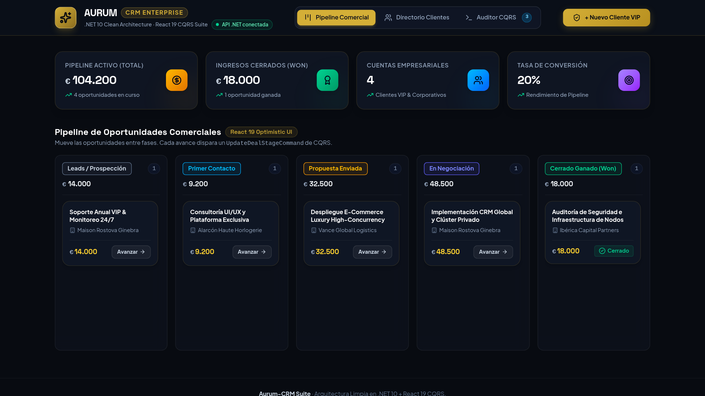
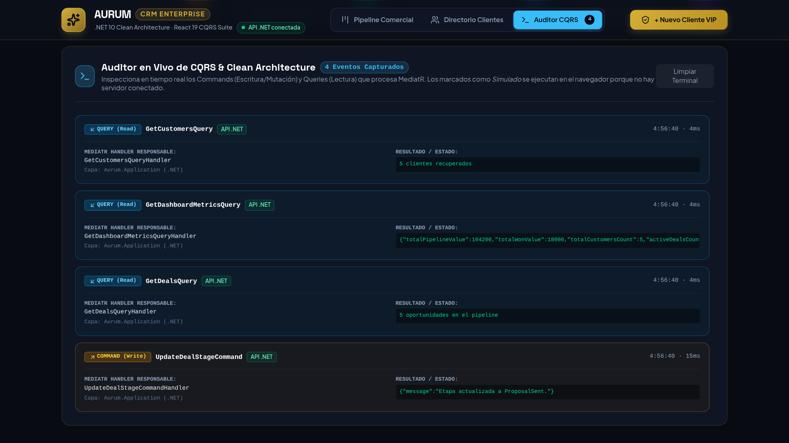
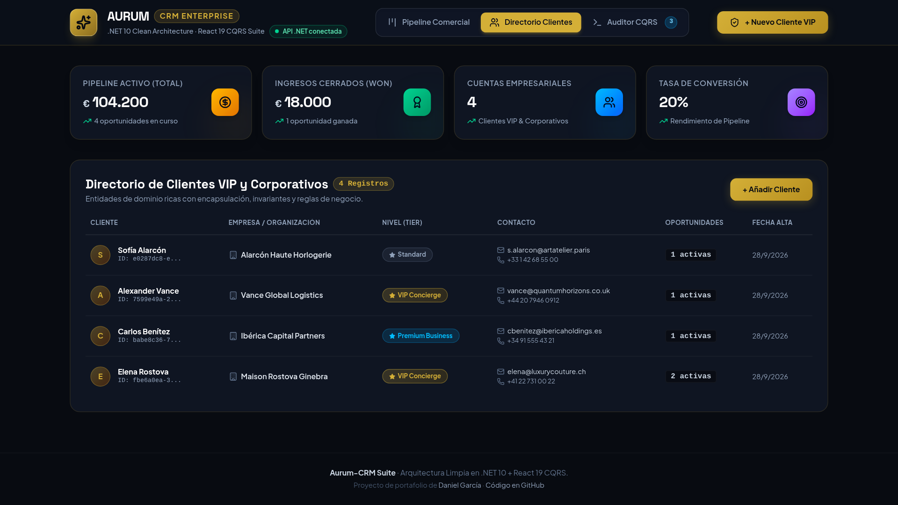
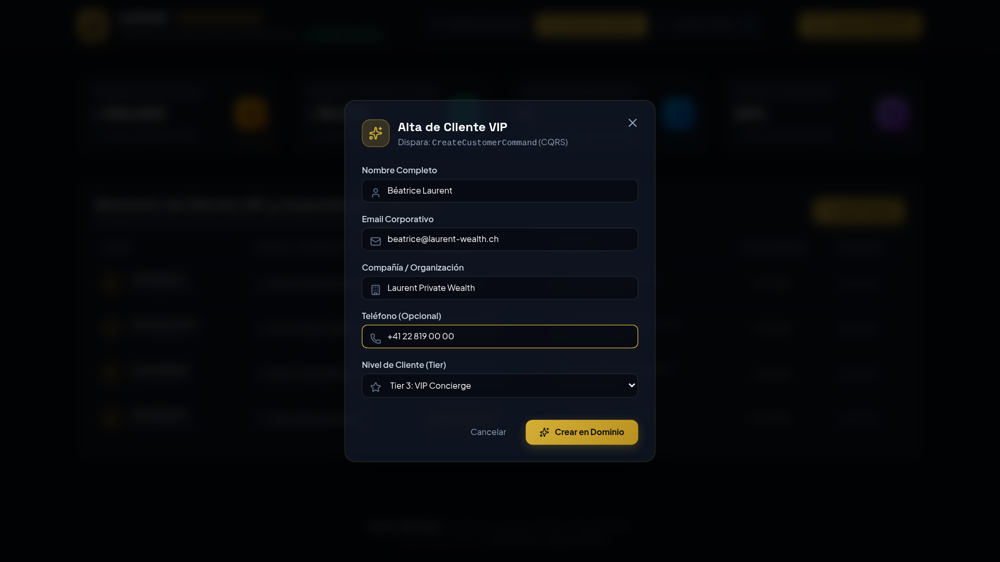
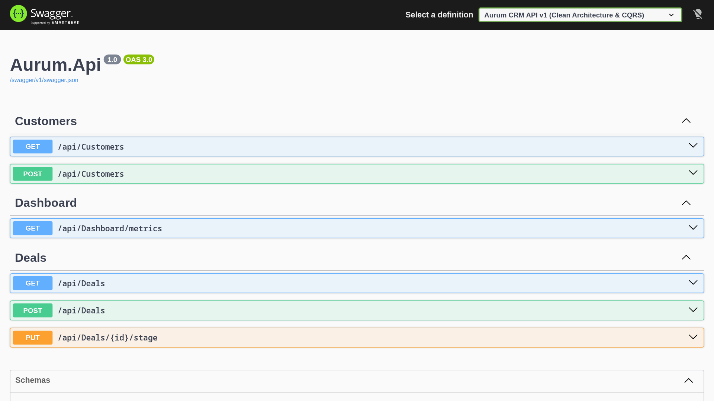
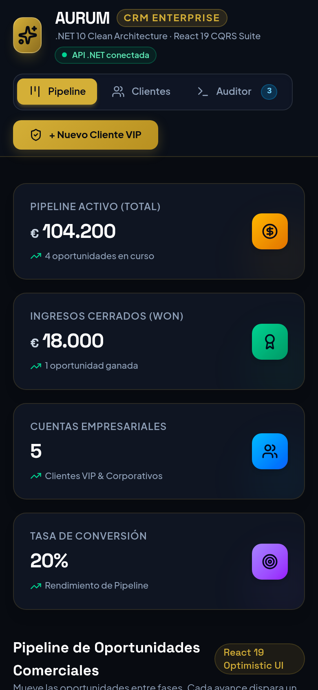

# 🏛️ Aurum-CRM: Enterprise Clean Architecture & CQRS Suite
> **Solución Empresarial End-to-End en .NET 10 y React 19**
> Diseñada para máxima escalabilidad, separación estricta de responsabilidades e interfaces de usuario de alta fidelidad.

---

## 🌟 Resumen Ejecutivo
**Aurum-CRM** es una plataforma de gestión comercial y relaciones con clientes de alto valor (Luxury / Corporate). Desarrollada como proyecto insignia de ingeniería de software, demuestra la implementación rigurosa de:
- **.NET 10** en backend utilizando **Clean Architecture** (Dominio puro, Casos de uso desacoplados, Repositorios e Inversión de Dependencias).
- Patrón **CQRS (Command Query Responsibility Segregation)** orquestado mediante **MediatR**.
- **React 19** en frontend (TypeScript + Vite), aprovechando `useOptimistic` para actualizaciones instantáneas de UI en 0ms y `useActionState` con Actions.
- **Auditor CQRS en vivo:** Panel de observabilidad integrado en la interfaz web para monitorear cada comando y consulta en tiempo real.
- **Reglas de negocio en el Dominio** (una oportunidad no puede retroceder ni cambiar tras cerrarse) cubiertas por **22 tests xUnit**, y errores de la API en formato estándar **RFC 7807 (ProblemDetails)**.

---

## 📸 Capturas



| Auditor CQRS en vivo | Directorio de clientes |
| :---: | :---: |
|  |  |
| **Alta de cliente (`CreateCustomerCommand`)** | **API REST documentada con Swagger** |
|  |  |

<p align="center"></p>

---

## 🏗️ Estructura del Repositorio

```text
Aurum-CRM/
├── Backend/                              # Solución .NET 10 (Formato moderno .slnx)
│   ├── AurumCRM.slnx
│   └── src/
│       ├── Aurum.Domain/                 # Capa de Dominio (Entidades ricas, Value Objects, Enums)
│       │   ├── Entities/                 # Customer.cs, Deal.cs (Invariantes de negocio, private set)
│       │   ├── Enums/                    # DealStage.cs, CustomerTier.cs
│       │   ├── Exceptions/               # DomainException (violación de regla de negocio)
│       │   └── ValueObjects/             # Money.cs
│       ├── Aurum.Application/            # Capa de Aplicación (Casos de uso & CQRS)
│       │   ├── Common/Interfaces/        # ICustomerRepository, IDealRepository, IUnitOfWork
│       │   ├── Customers/Commands/       # CreateCustomerCommand & Handler
│       │   ├── Customers/Queries/        # GetCustomersQuery & Handler
│       │   ├── Deals/Commands/           # CreateDealCommand, UpdateDealStageCommand
│       │   ├── Deals/Queries/            # GetDealsQuery
│       │   ├── Dashboard/Queries/        # GetDashboardMetricsQuery
│       │   └── DTOs/                     # CustomerDto, DealDto, DashboardMetricsDto
│       ├── Aurum.Infrastructure/         # Capa de Infraestructura (Persistencia técnica)
│       │   ├── Data/                     # AurumDbContext (EF Core), AurumDbSeeder (Seed data VIP)
│       │   └── Repositories/             # CustomerRepository, DealRepository, UnitOfWork
│       └── Aurum.Api/                    # Punto de entrada Web API REST
│           ├── Controllers/              # CustomersController, DealsController, DashboardController
│           ├── Infrastructure/           # DomainExceptionHandler → ProblemDetails (400/404)
│           └── Program.cs                # Inyección de dependencias, CORS, Swagger
│   └── tests/
│       ├── Aurum.Domain.Tests/           # Reglas de negocio de Deal, Customer y Money (sin mocks)
│       └── Aurum.Application.Tests/      # Handlers CQRS con repositorios en memoria
│
├── Frontend/                             # SPA React 19 + TypeScript + Vite
│   ├── src/
│   │   ├── components/                   # Navbar, KpiMetrics, PipelineBoard, CustomersList,
│   │   │                                 # CreateCustomerModal, CqrsInspector
│   │   ├── services/                     # api.ts (Cliente HTTP + modo demo + CQRS event emitter)
│   │   ├── types/                        # crm.ts (Contratos tipados TypeScript)
│   │   ├── App.tsx                       # Orquestación de vistas y estado reactivo
│   │   └── index.css                     # Sistema de diseño Aurum Luxury (Deep Navy + Gold)
│   └── package.json                      # React ^19.2, Lucide Icons, Vite
```

---

## 🚀 Cómo Ejecutar el Proyecto

### 1. Backend (.NET 10)
Asegúrate de tener instalado el SDK de .NET 10.
```bash
cd Backend
dotnet run --project src/Aurum.Api
```
* La API se iniciará en `http://localhost:5000` con Swagger UI interactivo en `http://localhost:5000/`.

Para ejecutar los tests:
```bash
cd Backend
dotnet test AurumCRM.slnx
```

### 2. Frontend (React 19)
```bash
cd Frontend
npm install
npm run dev
```
* Abre `http://localhost:5173` en tu navegador.
* **Modo demo:** la URL de la API se configura con la variable `VITE_API_URL` (en desarrollo ya apunta a `http://localhost:5000/api` vía `.env.development`). Si no está definida o la API no responde, el frontend simula los Commands y Queries en el navegador con las mismas reglas de negocio, y lo indica con la etiqueta **"Modo demo · sin servidor"**; en el Auditor CQRS cada evento aparece marcado como *API .NET* o *Simulado*. Así la demo pública funciona como sitio estático sin backend.
